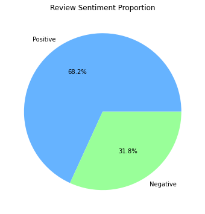
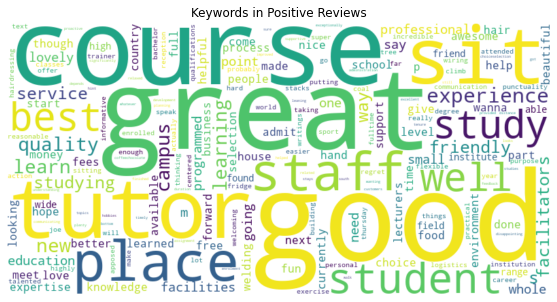
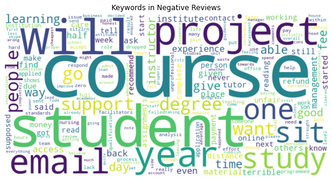
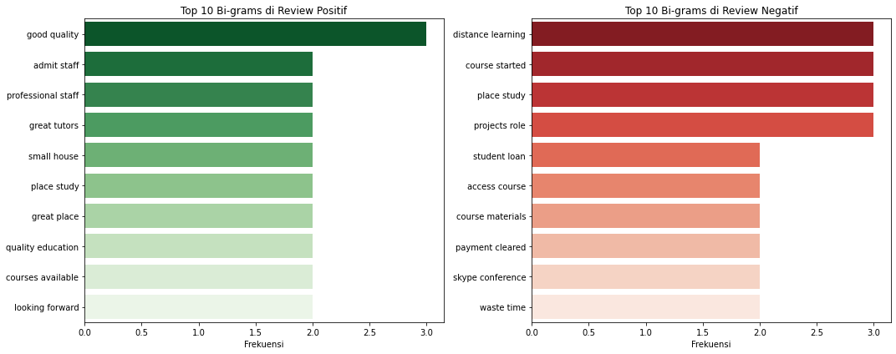
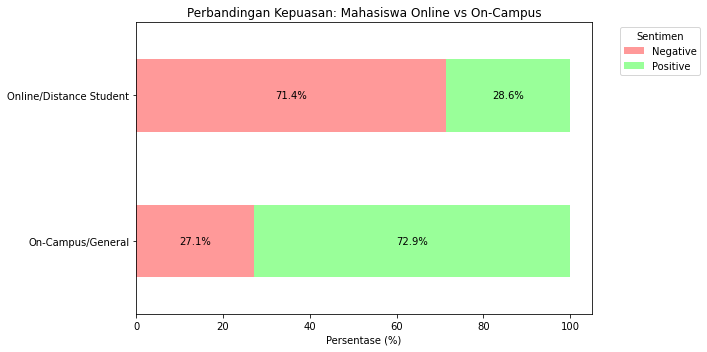
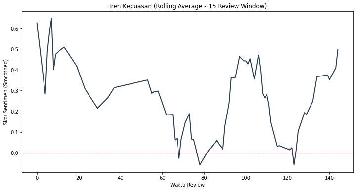

# SIT-Sentiment-Analysis

## Haruskah Saya Berkuliah Disini? Analisis Sentimen Terhadap Ulasan Southern Institute of Technology

### 1. Latar Belakang
  Dalam proses pemilihan studi lanjut, Southern Institute of Technology (SIT) di Selandia Baru menjadi salah satu pilihan yang menarik perhatian setelah menghadiri pameran pendidikan internasional. Akan tetapi, muncul pertanyaan, "Apakah kampus ini memiliki reputasi yang baik atau tidak?". Untuk menjawab pertanyaan ini tidak cukup hanya dengan melihat rating bintang saja karena rating bisa saja bias atau tidak akurat.

### 2. Metodologi
#### 2.1 *Data Collection*
Data yang digunakan diperoleh dari:
1. Google Maps Reviews: Diambil menggunakan metode scraping via Apify (sumber data utama),
2. Educational Portals: Data ulasan pelengkap diperoleh dari masterportal.com dan hotcoursesabroad.com.

#### 2.2 *Data Preparation*
1. *Handling Missing Values*: Membuang data yang tidak memiliki ulasan (ulasan = NA),
2. *Data Type Conversion*: Menyesuaikan tipe data pada setiap kolom,
3. *Text Normalization*: Mengkonversi huruf menjadi huruf kecil (*lowercase*) dan membuang spasi berlebih (*whitespace removal*),
4. *Automated Audit*: Membuat fungsi untuk mendeteksi kata kotor (sensor kata, repetisi karakter, typo),
5. *Translation*: Menggunakan Google Translate API untuk menjaga data ulasan non-inggris tetap terpakai,
6. *Slang & Typo Correction*: Membuat fungsi untuk mengatasi masalah typo dan bahasa 'slang',
7. *Censored Word, Repeated Chars, Punctuation*: Membuat fungsi untuk menangani kata yang disensor, karakter berulang, dan menghilangkan tanda baca.

### 3. Insight

1.

  Ulasan dengan sentimen positif mendominasi dengan persentase 68.2%. Akan tetapi, persentase ulasan negatif juga tergolong cukup tinggi dengan persentase sebesar 31.8%.

2.

  WordCloud menunjukkan sentimen positif didominasi oleh kata great, good, staff, dan tutor dan pada sentimen negatif didominasi oleh kata student, project, dan email. Hal menarik terlihat pada kata course yang muncul pada sentimen positif dan negatif. Akan tetapi hanya diketahui bahwa kata course adalah topik utama dari ulasan yang diterima oleh SIT. Wordcloud unigram tidak dapat menangkap konteks dari kata course.

3.

  Analisis bi-gram ulasan positif menunjukkan bahwa frekuensi tertinggi muncul pada frasa good quality, admit staff, professional staff, dan great tutors. Hal ini menunjukkan pemberi ulasan memiliki pengalaman yang positif terhadap kualitas pengajar dan staf pada kampus SIT. Akan tetapi kepuasan ini terbentur oleh pengalaman sistem pembelajaran jarak jauh (terlihat pada frasa distance learning dan frasa skype conference muncul pada analisis bi-gram ulasan negatif) dan administrasi keuangan (terlihat pada frasa student loan dan payment cleared muncul pada bi-gram ulasan negatif).

4.

  Berdasarkan analisis ini terlihat bahwa mayoritas pemberi ulasan yang berkuliah secara online memiliki sentimen negatif terhadap kampus ini. Akan tetapi sebaliknya, mayoritas pemberi ulasan yang berkuliah secara tatap muka memiliki sentimen yang positif. Hasil analisis inipun menjawab hipotesa sebelumnya bahwa mahasiswa yang berkuliah secara online lebih merasa tidak puas dengan kampus ini.

Catatan: Jumlah sampel untuk mahasiswa online sangatlah kecil (hanya 7 ulasan). Ini berbanding terbalik dengan jumlah sampel untuk mahasiswa tatap muka yang memiliki jumlah yang cukup solid (sebanyak 59 ulasan). Akan tetapi, ini tidak menutup fakta bahwa 5 dari 7 ulasan menganggap bahwa pembelajaran online dikampus ini tidak memuaskan dan tetap menjadi sinyal kuat bahwa adanya masalah.

5.

  Puncak tren kepuasan berada di tahun 2016, akan tetapi tren kemudian berangsur menurun hingga sampai di titik terendahnya pada tahun 2020 (yang kemungkinan disebabkan oleh pandemi COVID-19). Selanjutnya tren kepuasan terlihat mengalami pemulihan di tahun 2024-2025.

### 4. Kesimpulan dan Rekomendasi

#### 4.1 Kesimpulan
Dari keseluruhan hasil analisis, dapat ditarik kesimpulan:

1. Southern Institute of Technology memiliki sistem akademik yang baik, terbukti dari pemberi ulasan secara konsisten memuji kualitas tutor dan mata kuliahnya.
2. Southern Institute of Technology memiliki kendala dalam pembelajaran secara *online* dimana pemberi ulasan mengeluhkan terkait pembelajaran jarak jauh (*distance learning* dan *skype conference*) dan memiliki kendala dalam administrasi keuangan (*student loan* dan *payment cleared*).
3. Kepuasan pemberi review sempat mengalami penurunan signifikan terutama pada tahun 2020-2021 yang kemungkinan diakibatkan oleh pandemi COVID-19. Akan tetapi tren kepuasan terlihat mengalami pemulihan mulai dari tahun 2024.

#### 4.2 Rekomendasi
  Southern Institute of Technology adalah pilihan yang baik secara akademis untuk pembelajaran secara tatap muka dan sebaiknya hindari pembelajaran jarak jauh jika memungkinkan. Akan tetapi, calon mahasiswa harus siap dengan kendala-kendala yang terjadi pada proses administratif.
